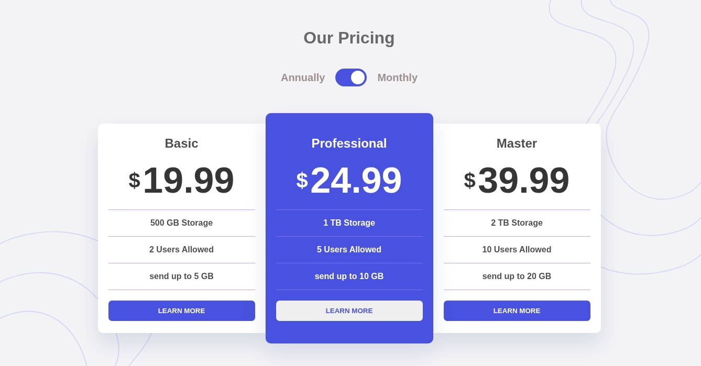

# Frontend Mentor - Pricing Component with Toggle Solution

This project is a responsive pricing component built as a solution to the [Pricing Component with Toggle challenge on Frontend Mentor](https://www.frontendmentor.io/challenges/pricing-component-with-toggle-8vPwRMIC).

It features a custom monthly/annually toggle switch that dynamically updates pricing information, with a fully responsive layout designed for different screen sizes.

Frontend Mentor challenges help developers improve their coding skills by building realistic projects.

## Table of contents

- [Overview](#overview)
  - [The challenge](#the-challenge)
  - [Screenshot](#screenshot)
  - [Links](#links)
- [Getting Started](#getting-started)
- [Project Structure](#project-structure)
- [My process](#my-process)
  - [Built with](#built-with)
  - [What I learned](#what-i-learned)
- [Author](#author)

## Overview

### The challenge

Users should be able to:

- View the optimal layout depending on their device's screen size (Fully Responsive Design).
- Switch between monthly and annually pricing plans using an interactive toggle component.
- See the correct pricing values dynamically updated when changing the toggle state.
- See hover and active states for interactive elements.
- Experience a clean and modern pricing interface across different screen sizes.

### Screenshot



### Links

- Solution URL: [Frontend Mentor solution link here]
- Live Site URL: [https://bigmum0a-wq.github.io/Pricing-component-page/](https://bigmum0a-wq.github.io/Pricing-component-page/)


## Getting Started

### Run the project locally

To run this project locally:

1. Clone this repository:

```bash
git clone https://github.com/bigmum0a-wq/Pricing-component-page.git
```

2. Navigate to the project directory:

```bash
cd Pricing-component-page
```

3. Open the application:

Open the following file in your browser:

```
main/index.html
```

No dependencies or installation steps are required. This project uses only HTML, CSS, and JavaScript.

You can also run it using a local development server such as the VS Code Live Server extension for a better development experience.

## Project Structure

```
Pricing-component-page
│
├── LICENSE
├── README.md
│
└── main
    │
    ├── index.html
    │
    └── assets
        │
        ├── css
        │   └── styles.css
        │
        ├── js
        │   └── script.js
        │
        ├── images
        │   ├── bg-top.svg
        │   └── bg-bottom.svg
        │
        └── design
            └── image.jpeg
```

## My process

### Built with

- Semantic HTML5 markup
- CSS custom properties
- CSS Grid and Flexbox
- Mobile-first responsive design
- Custom toggle switch component using HTML and CSS
- Pure JavaScript (DOM manipulation, Event Listeners)
- Dynamic content update based on user interaction

### What I learned

Building this project helped me improve my understanding of responsive layouts using CSS Grid and Flexbox.

I practiced creating custom interactive components without external libraries, especially a pricing toggle switch that updates pricing information dynamically using JavaScript.

This project reinforced my knowledge of:

- Managing UI states with JavaScript
- Handling user interactions with event listeners
- Creating reusable CSS components
- Building responsive layouts from visual references

## Author

- Frontend Mentor - [@bigmum0a-wq](https://www.frontendmentor.io/profile/bigmum0a-wq)
